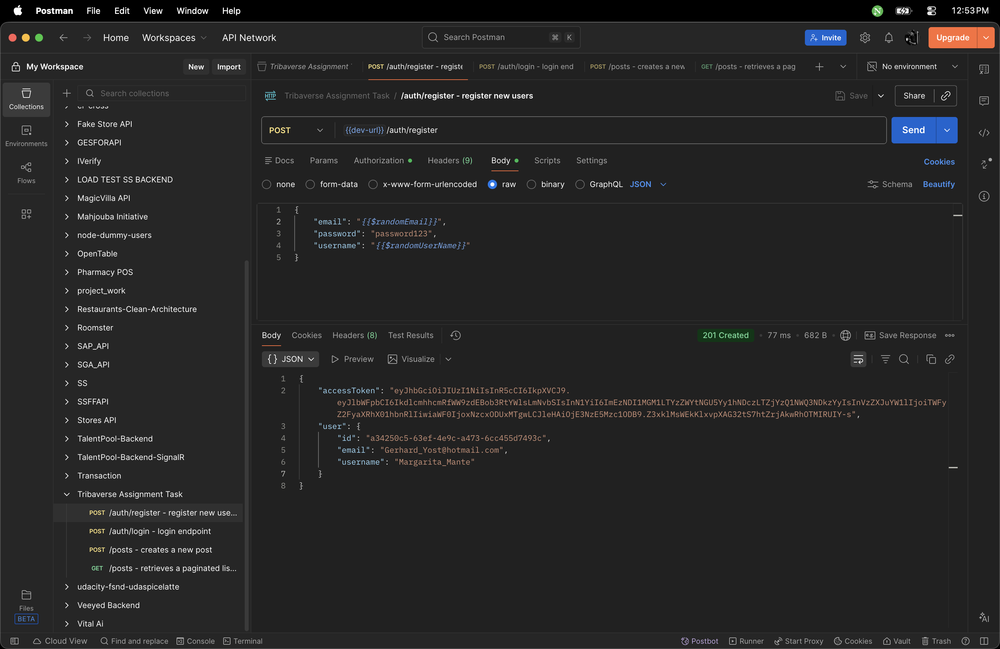
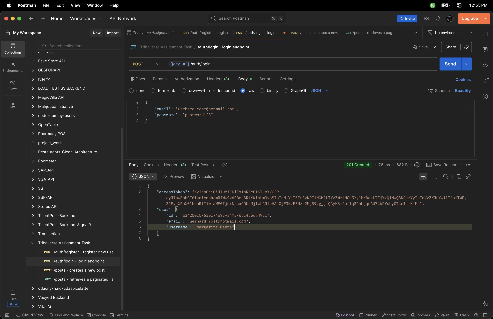
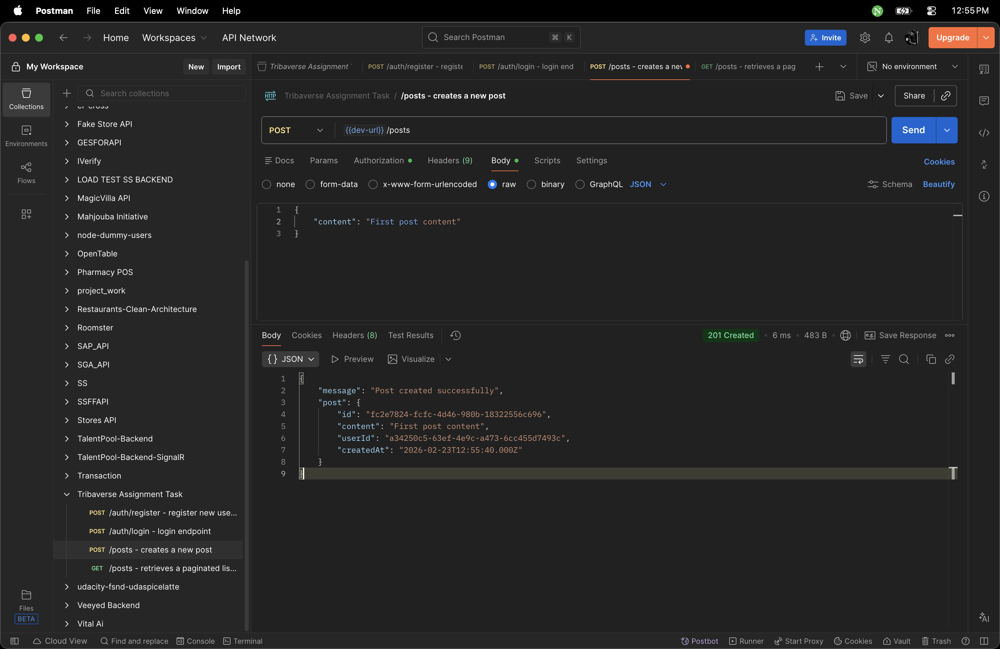
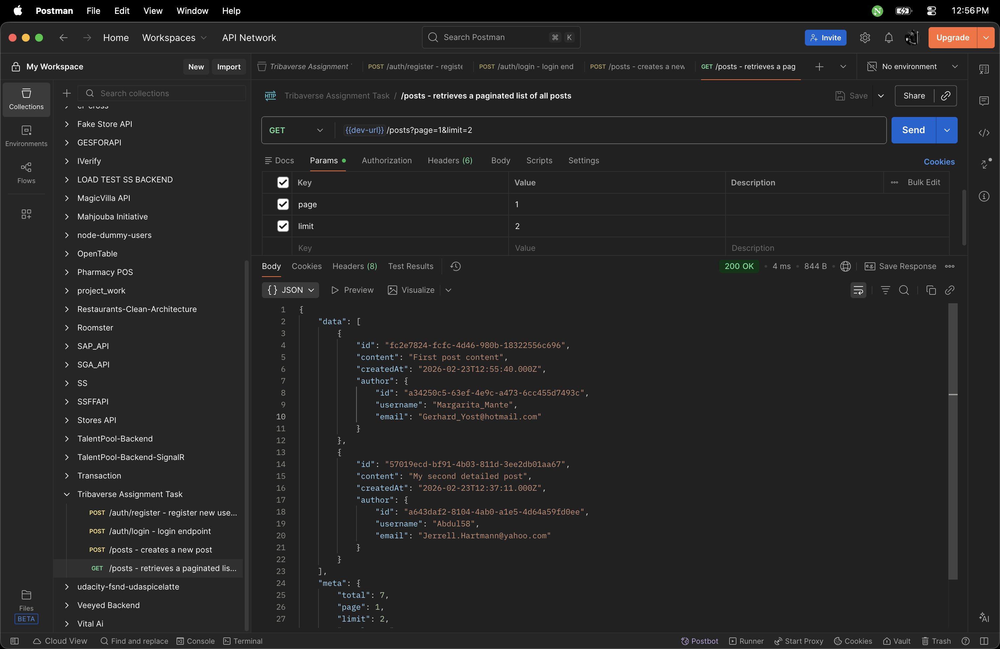
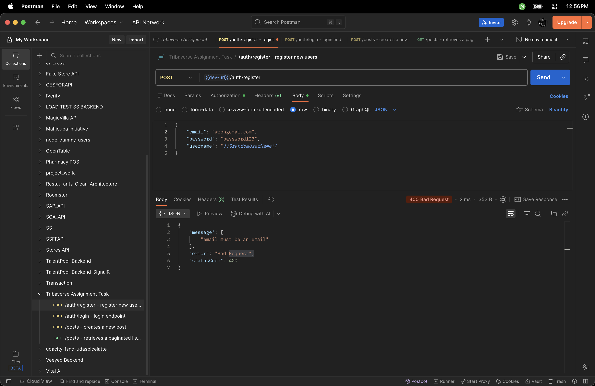
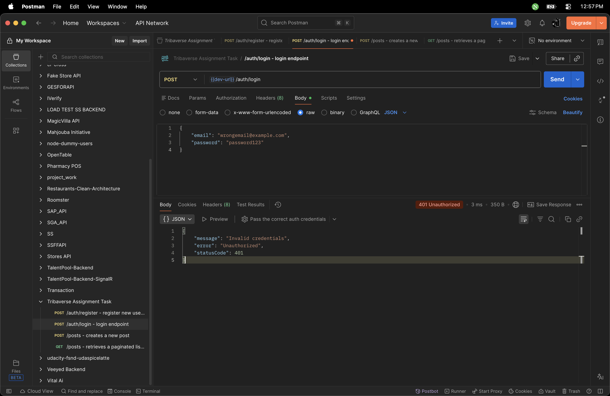
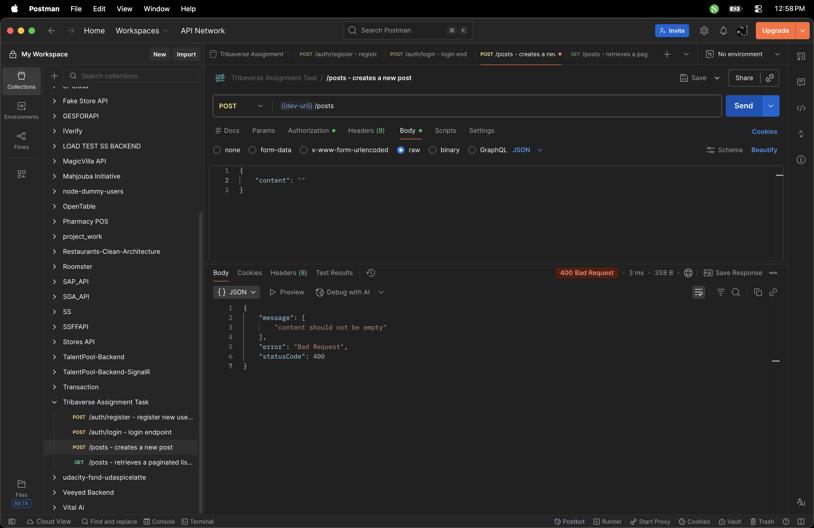
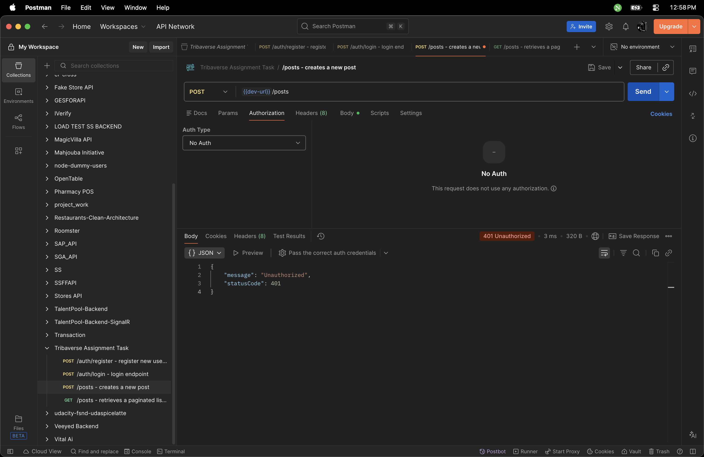

# Tribaverse API - REST API Assignment

A simple REST API built with NestJS, TypeScript, and SQLite that allows users to create accounts, authenticate, and create/retrieve posts with pagination.

## Table of Contents

- [Features](#features)
- [Tech Stack](#tech-stack)
- [Prerequisites](#prerequisites)
- [Installation](#installation)
- [Running the Application](#running-the-application)
- [API Documentation](#api-documentation)
- [API Screenshots](#api-screenshots)
- [Project Structure](#project-structure)
- [Design Decisions](#design-decisions)

## Features

- ✅ User registration and authentication (JWT)
- ✅ Create and retrieve text-based posts
- ✅ Pagination support for posts listing
- ✅ Input validation and error handling
- ✅ Clean, modular architecture
- ✅ SQLite database (no external setup required)

## Tech Stack

- **Framework**: NestJS
- **Language**: TypeScript
- **Database**: SQLite (sql.js driver)
- **ORM**: TypeORM
- **Authentication**: JWT (Passport)
- **Validation**: class-validator, class-transformer

## Prerequisites

- Node.js (v24 or higher)
- npm or yarn

## Installation

1. Clone the repository:

```bash
git clone <repository-url>
cd tribaverse-api-task
```

1. Install dependencies:

```bash
npm install
```

1. Create a `.env` file in the root directory (copy from `.env.example`):

```bash
cp .env.example .env
```

1. Update the `.env` file with your configuration:

```env
JWT_SECRET=super-secret-key
JWT_EXPIRATION=24h
PORT=3000
```

## Running the Application

### Development Mode

```bash
npm run start:dev
```

The API will be available at `http://localhost:3000`

### Production Mode

```bash
npm run build
npm run start:prod
```

## API Documentation

### Base URL

```
http://localhost:3000
```

### Endpoints

#### 1. Register a New User

**POST** `/auth/register`

Creates a new user account.

**Request Body:**

```json
{
  "email": "user@example.com",
  "password": "securepassword123",
  "username": "johndoe"
}
```

**Response (201 Created):**

```json
{
  "accessToken": "eyJhbGciOiJIUzI1NiIsInR5cCI6IkpXVCJ9...",
  "user": {
    "id": "uuid-here",
    "email": "user@example.com",
    "username": "johndoe"
  }
}
```

**Validation Rules:**

- Email must be a valid email address
- Password must be at least 6 characters
- Username must be at least 3 characters

**Error Responses:**

- `400 Bad Request` - Invalid input data
- `409 Conflict` - Email already exists

---

#### 2. Login

**POST** `/auth/login`

Authenticates a user and returns a JWT token.

**Request Body:**

```json
{
  "email": "user@example.com",
  "password": "securepassword123"
}
```

**Response (200 OK):**

```json
{
  "accessToken": "eyJhbGciOiJIUzI1NiIsInR5cCI6IkpXVCJ9...",
  "user": {
    "id": "uuid-here",
    "email": "user@example.com",
    "username": "johndoe"
  }
}
```

**Error Responses:**

- `401 Unauthorized` - Invalid credentials

---

#### 3. Create a Post

**POST** `/posts`

Creates a new post (requires authentication).

**Headers:**

```
Authorization: Bearer <your-jwt-token>
```

**Request Body:**

```json
{
  "content": "This is my first post on Tribaverse!"
}
```

**Response (201 Created):**

```json
{
  "message": "Post created successfully",
  "post": {
    "id": "uuid-here",
    "content": "This is my first post on Tribaverse!",
    "userId": "user-uuid",
    "createdAt": "2026-02-21T12:00:00.000Z"
  }
}
```

**Validation Rules:**

- Content must not be empty
- Content must be a string
- Content must not exceed 1000 characters

**Error Responses:**

- `401 Unauthorized` - Missing or invalid token
- `400 Bad Request` - Invalid input data

---

#### 4. Get All Posts (with Pagination)

**GET** `/posts?page=1&limit=10`

Retrieves a paginated list of all posts.

**Query Parameters:**

- `page` (optional): Page number (default: 1, min: 1)
- `limit` (optional): Items per page (default: 10, min: 1, max: 100)

**Response (200 OK):**

```json
{
  "data": [
    {
      "id": "uuid-here",
      "content": "This is my first post on Tribaverse!",
      "createdAt": "2026-02-21T12:00:00.000Z",
      "author": {
        "id": "user-uuid",
        "username": "johndoe",
        "email": "user@example.com"
      }
    }
  ],
  "meta": {
    "total": 25,
    "page": 1,
    "limit": 10,
    "totalPages": 3,
    "hasNextPage": true,
    "hasPreviousPage": false
  }
}
```

---

### Example Usage with cURL

#### Register

```bash
curl -X POST http://localhost:3000/auth/register \
  -H "Content-Type: application/json" \
  -d '{
    "email": "test@example.com",
    "password": "password123",
    "username": "testuser"
  }'
```

#### Login

```bash
curl -X POST http://localhost:3000/auth/login \
  -H "Content-Type: application/json" \
  -d '{
    "email": "test@example.com",
    "password": "password123"
  }'
```

#### Create Post

```bash
curl -X POST http://localhost:3000/posts \
  -H "Content-Type: application/json" \
  -H "Authorization: Bearer YOUR_JWT_TOKEN" \
  -d '{
    "content": "My first post!"
  }'
```

#### Get Posts

```bash
curl http://localhost:3000/posts?page=1&limit=10
```

## API Screenshots


_Successful user registration_


_Successful user login_


_Successful post creation_


_Retrieved paginated list of posts_


_Email validation checks_


_Valid user and password checks_


_Valid post content check_


_Authentication check_

## Project Structure

```
src/
├── auth/
│   ├── dto/
│   │   ├── login.dto.ts          # Login validation
│   │   └── register.dto.ts       # Registration validation
│   ├── guards/
│   │   └── jwt-auth.guard.ts     # JWT authentication guard
│   ├── auth.controller.ts        # Auth endpoints
│   ├── auth.module.ts            # Auth module configuration
│   ├── auth.service.ts           # Auth business logic
│   └── jwt.strategy.ts           # JWT strategy for Passport
├── users/
│   ├── entities/
│   │   └── user.entity.ts        # User database model
│   ├── users.module.ts           # Users module
│   └── users.service.ts          # User operations
├── posts/
│   ├── dto/
│   │   ├── create-post.dto.ts    # Post creation validation
│   │   └── pagination.dto.ts     # Pagination parameters
│   ├── entities/
│   │   └── post.entity.ts        # Post database model
│   ├── posts.controller.ts       # Posts endpoints
│   ├── posts.module.ts           # Posts module
│   └── posts.service.ts          # Posts business logic
├── app.module.ts                 # Root module
└── main.ts                       # Application entry point
```

## Design Decisions

### 1. **Architecture**

- **Modular Design**: Separated concerns into distinct modules (Auth, Users, Posts)
- **Layered Architecture**: Controller → Service → Repository pattern
- **Dependency Injection**: Leveraged NestJS's built-in DI container for loose coupling

### 2. **Database Choice**

- **SQLite (sql.js)**: Chosen for zero external dependencies and easy testing
- **TypeORM**: Provides type-safe database operations and migrations
- **Entities**: UUID primary keys for better scalability and security

### 3. **Authentication**

- **JWT Strategy**: Stateless authentication for scalability
- **Bcrypt**: Industry-standard password hashing (10 rounds)
- **Guards**: Reusable authentication middleware

### 4. **Validation**

- **DTOs with class-validator**: Type-safe request validation
- **Transform Pipe**: Automatic type conversion for query parameters
- **Whitelist**: Strips unknown properties for security

### 5. **Error Handling**

- **Built-in Exception Filters**: Consistent error responses
- **HTTP Status Codes**: Proper RESTful status codes
- **Validation Errors**: Detailed error messages for debugging

### 6. **Pagination**

- **Offset-based**: Simple and effective for this use case
- **Metadata**: Includes total count, page info, and navigation flags
- **Default Limits**: Prevents excessive data retrieval

### 7. **Scalability Considerations**

- **Stateless Auth**: JWT tokens enable horizontal scaling
- **Database Indexes**: Foreign keys and unique constraints
- **Eager Loading**: Optimized queries with relations
- **Configuration**: Environment-based settings

### 8. **Code Quality**

- **TypeScript**: Static typing for better maintainability
- **Separation of Concerns**: Each module has a single responsibility
- **Clean Code**: Descriptive naming and small, focused functions

---

## Testing

To run tests:

```bash
npm run test
```

---

## Author

**Samuel Nyamekesse**  
Software Engineer

---

## License

This project is part of a coding assignment for Tribaverse.
